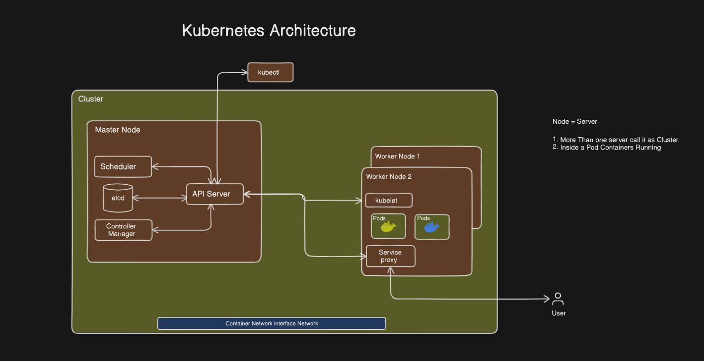

# Kubernetes (K8s) Notes

## 1. Introduction to Kubernetes

- **Origin:**
  - Developed by **Google in 2014**
  - Based on Google’s internal system **Borg**
  - Released as **open-source**

- **Definition:**
  - Kubernetes is an **orchestration tool** used for automating deployment, scaling, and management of containerized applications.

- **Nickname:**
  - Kubernetes is often abbreviated as **K8s** (K + 8 letters + s)

- **Governance:**
  - Now maintained by **CNCF** (Cloud Native Computing Foundation)

---

## 2. Core Concepts: Monolithic vs. Microservices

| Monolithic Architecture         | Microservices Architecture           |
|----------------------------------|--------------------------------------|
| Difficult to manage              | Easy to manage                       |
| All components tightly coupled   | Each service is independent          |
| Example: Dealdox                 | Example: D-Mart                      |
| High cost                        | Lower cost                           |

---

## 3. Why Learn Kubernetes?

- Increasing demand for **microservices-based applications**
- Kubernetes helps manage **Docker containers** efficiently

---

## 4. Kubernetes Architecture Diagram

- **Node = Server**
  1. More than one server forms a **Cluster**
  2. Inside a **Pod**, containers are running
---

## 5. Components Explained

### 📌 Master Node
- **API Server**: Acts like a **Team Lead**, central communication point.
- **Scheduler**: Assigns pods to nodes.
- **etcd**: Key-value store used as the cluster database.
- **Controller Manager**: Ensures the desired state of components.

### 📌 Worker Node
- **Node**: A physical or virtual server.
- **Kubelet**: Node agent to manage containers.
- **Kube-proxy**: Handles network rules and external access.
- **Pod**: Smallest deployable unit containing one or more containers.

---

## 6. Additional Concepts

- **Cluster**: Group of nodes managed together.
- **CNI (Container Network Interface)**: Plugin for networking.  
  Example: `weave net`

---

## 7. Analogies

| Component         | Analogy                    |
|------------------|----------------------------|
| Docker           | Startup                    |
| Kubernetes       | MNC                        |
| Node             | Server                     |
| Cluster          | Multiple servers together  |
| API Server       | Team Lead                  |
| kubelet          | Node Manager               |
| Pod              | Room with containers       |

---

## 8. Kubernetes Setup Methods

1. **kubeadm** – Production setup (higher cost)
2. **minikube** – Local testing (or single EC2)
3. **Kind** – Kubernetes in Docker
4. **EKS** – AWS-managed Kubernetes (Elastic Kubernetes Service)

---

## 9. Setting up KIND Cluster

> Search for **"Kind cluster"** on Google and follow official documentation.

---